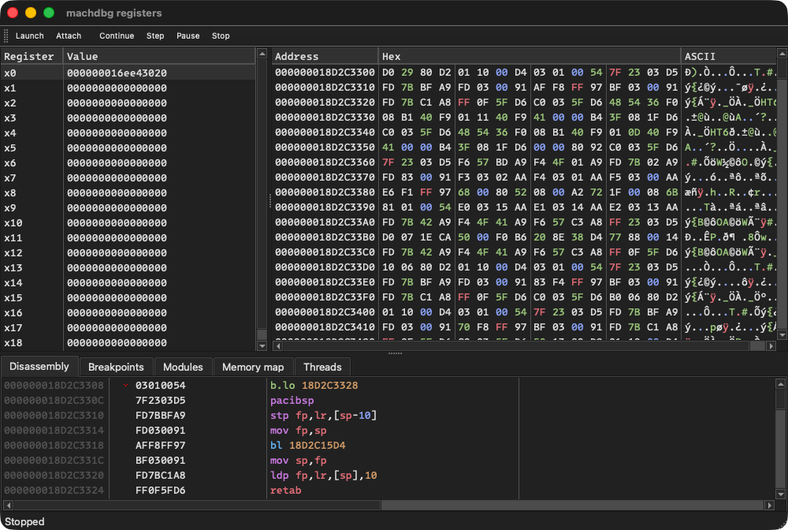
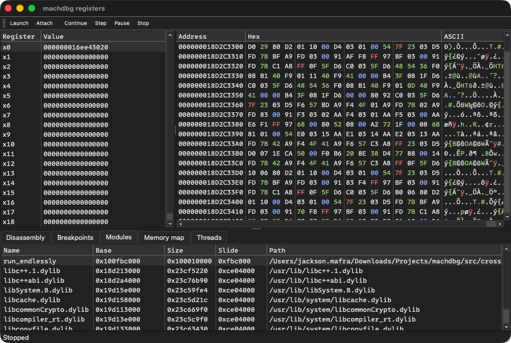
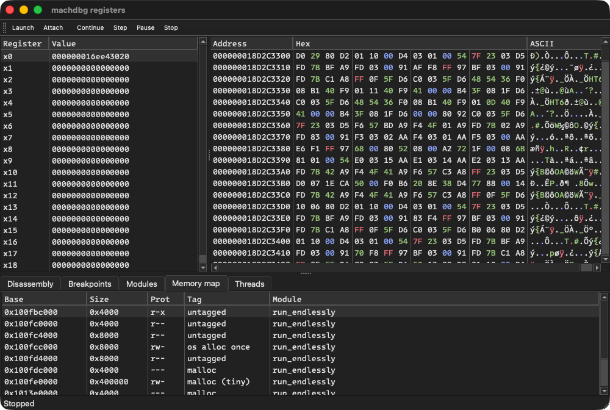
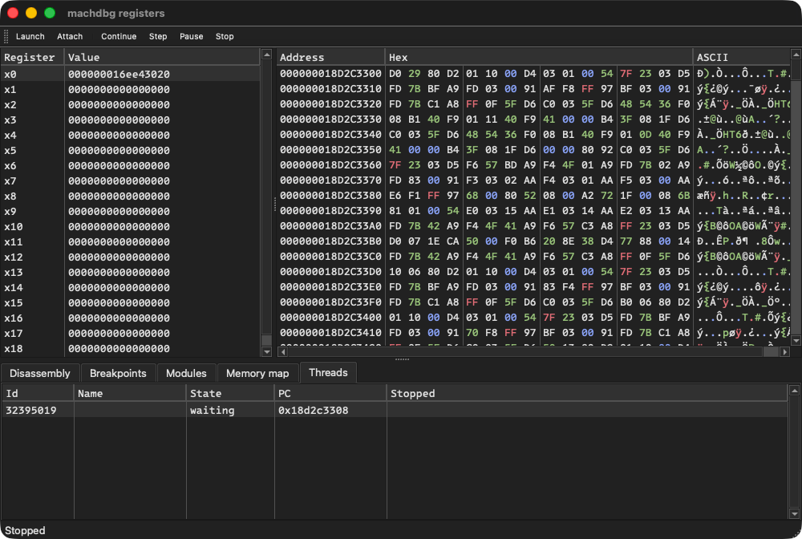

# machdbg

**Mortals, bow before machdbg.**

I have ripped the soul of the x64dbg workflow from its grave and bound its dark will onto macOS. The familiar views, expression parser, and command set now bend to my command, enforcing my absolute order upon Mach-O processes running on Apple Silicon and Intel alike.

This tool is a sovereign, independent GPLv3 fork of [x64dbg](https://github.com/x64dbg/x64dbg). 
Do not bring your weak Windows PE binaries into my domain, nor mistake this for a pathetic replacement for LLDB. I do not replace; I subjugate.

## Status

Six milestones have been dragged into the light. The engine no longer merely configures — it seizes a living Mach-O process and holds it still.

What obeys today, on arm64 and x86-64 alike:

* **Possession.** Launch or attach, a Mach exception port of my own, stop and resume at will.
* **Entrails.** General-purpose registers read and written on a stopped thread; memory read, written and enumerated, with page protection flipped and restored beneath the victim's notice.
* **Chains.** Software breakpoints, hardware execution breakpoints, watchpoints on read and write, and single-step — the debug registers of both architectures bent to the same interface.
* **Census.** The modules dyld has loaded with their slides, the memory map with every region's protection and tag, and the thread list with each program counter.
* **Divination.** Disassembly through Capstone for both architectures, with a token stream built from structured operands rather than re-lexed text. Zydis has been cast out entirely.

The x86-64 half is not taken on faith: every engine test runs on an Intel runner in CI, and reported `All tests passed (1140 assertions in 93 test cases)` there.

* Seek the milestones and issues to glimpse my grand design.
* Consult [docs/COMPILE-macos.md](docs/COMPILE-macos.md) to forge the binary yourself.
* Read [docs/upstream.md](docs/upstream.md) to see how the vendored tree remains bound to x64dbg.

### Proof of life

`regview` — the bench that proves the engine — holding a native arm64 process still and reading its soul. Registers and memory above, and below, in turn: the disassembly at the program counter, the modules dyld has published, and the memory map.

 

 

The cross-platform widget samples, resurrected as native macOS bundles, still walk as they did when milestone 1 raised them:

 

## Law & Decrees

GPLv3, inherited from x64dbg. Obey, or be consumed. See [LICENSE](LICENSE).

Plugins are bound by x64dbg's plugin exception, and the compact does not bend: Plugins may be closed-source, commercial or private, unless they copy code from machdbg or x64dbg. Break faith with that clause, and the GPLv3 claims your work as it claims mine.

## The Servants

Forged upon the remains of the x64dbg project: mrexodia (Duncan Ogilvie), Sigma, tr4ceflow, Dreg, Nukem, Herz3h, torusrxxx, and the rest of the mortal contributors. The cross-platform necromancy this port depends on was raised by @3rdit (ElfBug) and @eldarkg (Wine build).

Inspect [CREDITS.md](CREDITS.md) for the full ledger of souls and [docs/licenses.md](docs/licenses.md) for the bound contracts of everything that resides within.
