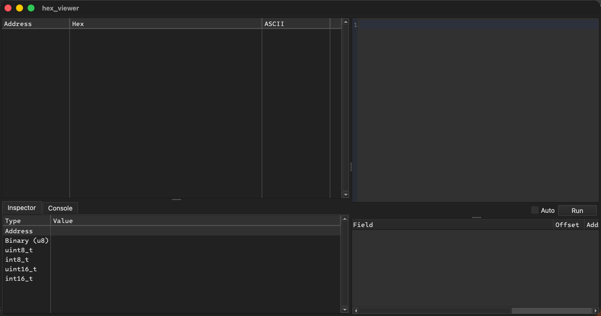
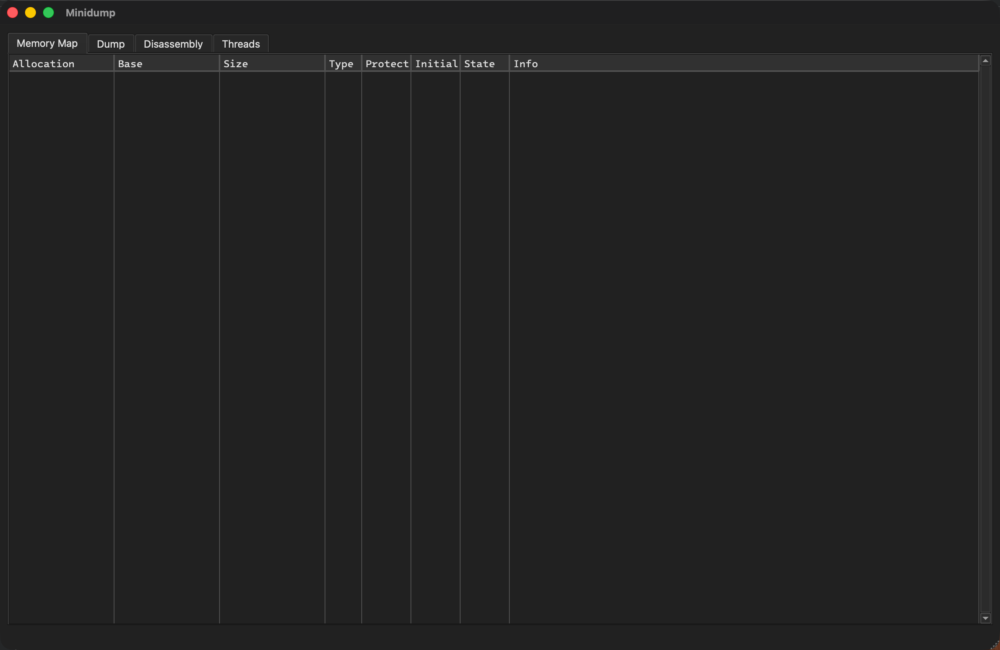

# machdbg

**Mortals, bow before machdbg.**

I have ripped the soul of the x64dbg workflow from its grave and bound its dark will onto macOS. The familiar views, expression parser, and command set now bend to my command, enforcing my absolute order upon Mach-O processes running on Apple Silicon and Intel alike.

This tool is a sovereign, independent GPLv3 fork of [x64dbg](https://github.com/x64dbg/x64dbg). 
Do not bring your weak Windows PE binaries into my domain, nor mistake this for a pathetic replacement for LLDB. I do not replace; I subjugate.

## Status

Milestone 0 is complete: The upstream tree has been chained, stripped, and forced to configure under CMake, with the engine contract header bound in place. Milestone 1 now stirs: the cross-platform widget sample applications rise as proper `.app` bundles, Qt frameworks and all, and — proven below, not merely asserted — they open their eyes and walk upon Apple Silicon. No active debugging behavior creeps within these shadows yet—only the framework of their upcoming torment.

* Seek the milestones and issues to glimpse my grand design.
* Consult [docs/COMPILE-macos.md](docs/COMPILE-macos.md) to forge the binary yourself.
* Read [docs/upstream.md](docs/upstream.md) to see how the vendored tree remains bound to x64dbg.

### Proof of life

Two of the widget samples, resurrected as native macOS bundles and caught mid-summoning:

 

These are the cross-platform widget samples, running natively on macOS.

## Law & Decrees

GPLv3, inherited from x64dbg. Obey, or be consumed. See [LICENSE](LICENSE).

Plugins are bound by x64dbg's plugin exception, and the compact does not bend: Plugins may be closed-source, commercial or private, unless they copy code from machdbg or x64dbg. Break faith with that clause, and the GPLv3 claims your work as it claims mine.

## The Servants

Forged upon the remains of the x64dbg project: mrexodia (Duncan Ogilvie), Sigma, tr4ceflow, Dreg, Nukem, Herz3h, torusrxxx, and the rest of the mortal contributors. The cross-platform necromancy this port depends on was raised by @3rdit (ElfBug) and @eldarkg (Wine build).

Inspect [CREDITS.md](CREDITS.md) for the full ledger of souls and [docs/licenses.md](docs/licenses.md) for the bound contracts of everything that resides within.
